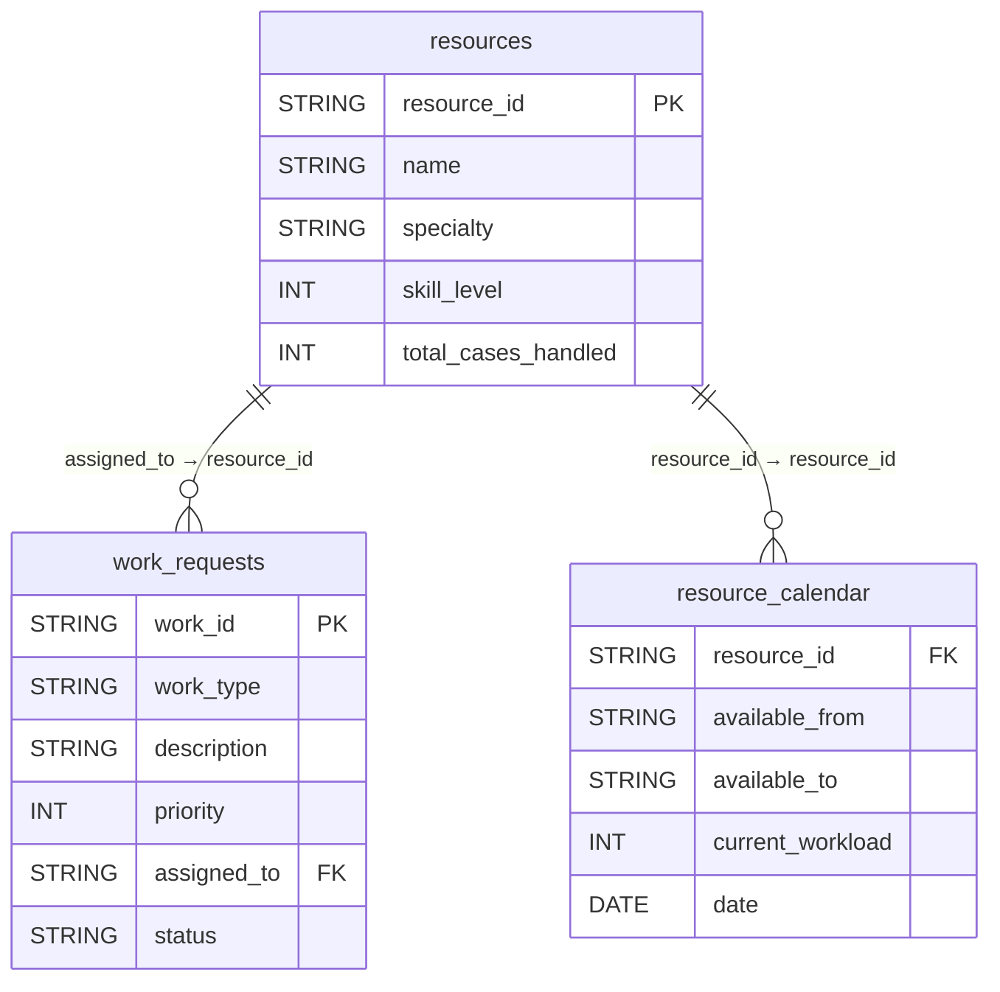
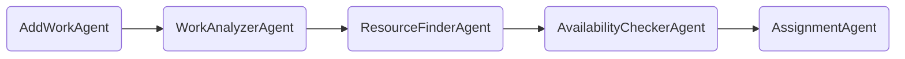

# Radiology Work Allocation System
A multi-agent AI-driven workflow that assigns radiology work requests to the most suitable radiologist based on **specialty match**, **availability**, **workload**, **experience**, and **case priority**.  
The solution mirrors real-world radiology operations and emphasizes **explainability**, **fair workload balancing**, and **clinical relevance**.

## 1. Overview
Problem statement:
Hospitals receive a high volume of radiology requests (MRI, CT, Ultrasound, X-Ray). Assigning the **right radiologist** is critical for:
- Diagnostic accuracy  
- Timely reporting  
- Balanced workload distribution  
- Patient safety  

This project builds a **Strands-based multi-agent system** that automatically:
1. Registers radiology work  
2. Analyzes the study type  
3. Finds matching radiologists  
4. Scores them using a transparent formula  
5. Assigns the best candidate  
6. Generates a professional 2–3 sentence justification using **Claude 3 Haiku (AWS Bedrock)** 
---

## 2. Setup Instructions

### 2.1 Dependencies

This project requires:

- Python 3.9+
- SQLite (built-in with Python)
- Jupyter Notebook
- The following Python packages:

```bash
pip install pandas
pip install pandas boto3 botocore amazon-bedrock
pip install strands strands-agents-tools
```
### 2.2 AWS Bedrock Configuration

The system uses **AWS Bedrock** (Claude 3 Haiku) to generate 2–3 sentence clinical explanations for each radiology assignment.

### **Prerequisites**
- An AWS account: To get user assess key
- Bedrock access enabled (Claude 3 models)
- region_name = `us-west-2`
- IAM user with permissions:
  - `bedrock:InvokeModel`
  - `bedrock:InvokeModelWithResponseStream`
  - `bedrock:ListFoundationModels`
---
## 3. Database Formation

Uses a lightweight **SQLite database (`service_ops.db`)** to store both radiology work requests and radiologist resources.  
This makes the system easy to run anywhere without requiring a separate database server.

### 3.1 How the Database is Formed

The database is automatically created and populated inside the Jupyter notebook using data from:

- `data/work_requests.csv`
- `data/resources.csv`
- `data/resource_calender.csv`

Each CSV file is converted into a SQLite table using `pandas.to_sql()`.

### 3.2 service_ops.db
#### Entity–Relationship (ER) Diagram


---
## 4. Multi-Agent Architecture (Using Strands)
### 4.1 why use Strands Instead of Other Agent Frameworks?
Unlike LLM-only agent frameworks (LangChain, AutoGPT), Strands executes **real Python functions**, ensuring:
- No hallucinations  
- Fully predictable results  
- Clear control over each workflow stage  

### 4.2 About the five agents used:
#### 4.2.1 AddWorkAgent — *Register New work*
**Purpose:** Creates a new work request and stores it in the database.
**Responsibilities**
- Insert `work_type`, `description`, and `priority`  
- Generate unique `work_id`  
- Set initial status = `"pending"`  
**Importance:** Provides a standardized entry point for all radiology studies.

#### 4.2.2 WorkAnalyzerAgent — *Determine Required Specialty*
**Purpose:** Reads the study type and identifies the appropriate radiology specialty.
**How It Works**
- Looks up `work_type` in `specialty_mapping.csv`  
- Falls back to `"General_Radiologist"` if not found  

#### 4.2.3 ResourceFinderAgent — *Fetch Matching Radiologists*
**Purpose:** Filters radiologists based on required specialty.
**Responsibilities**
- Query `resources` table  
- Return all radiologists with matching specialty
**Importance** Narrows the candidate pool to medically appropriate specialists.

#### 4.2.4 AvailabilityCheckerAgent — *Score & Rank Radiologists*
**Purpose:**  
Computes a transparent, multi-factor score for each radiologist to identify the best fit for a given study.

**Evaluated Factors:**
- **Skill level** — clinical expertise  
- **Experience** — total cases handled  
- **Availability** — inverse of workload  
- **Current workload** — number of ongoing cases  
- **Case priority** — urgency level (1–5)

**Scoring Formula Components:**
- **skill × 2** → emphasizes radiologist expertise  
- **total_cases × 0.05** → rewards experience in similar studies  
- **(10 − workload)** → availability score (fewer cases = more available)  
- **workload × 1.2** → workload penalty to avoid overloading radiologists  
- **priority_bonus** →  
  - +10 for **Priority 5** (emergency)  
  - +5 for **Priority 4** (urgent)  
  - +0 for routine or low-priority cases  

This scoring model ensures that urgent studies are routed to both the **most qualified** and **most available** radiologist while maintaining **fair workload distribution**.
#### 4.2.5 AssignmentAgent — *Assign & Explain*
**Purpose**
Finalizes assignment and generates a human-readable explanation.
**Responsibilities**
- Write `assigned_to` into `service_ops.db`  
- Set status to `"assigned"`  
- Generate a **2–3 sentence justification** using Claude 3 Haiku (AWS Bedrock)  
**Why Needed**
Adds interpretability and clinical reasoning to the final decision.
---
## 5. Multi-Agent Pipeline



